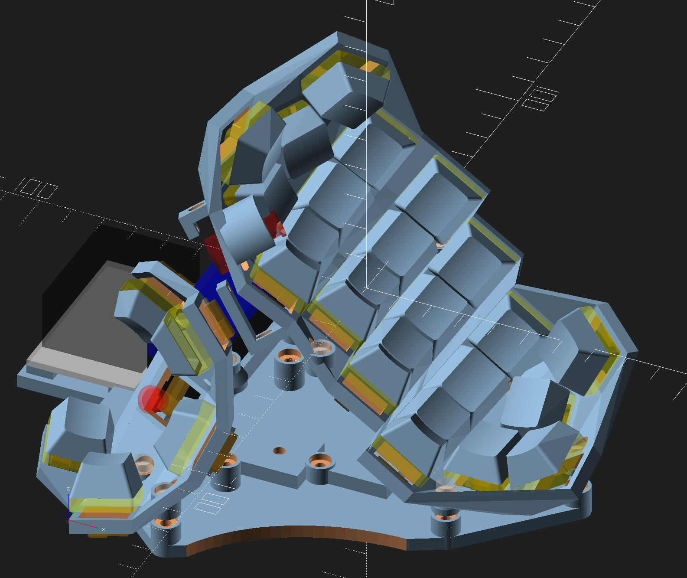
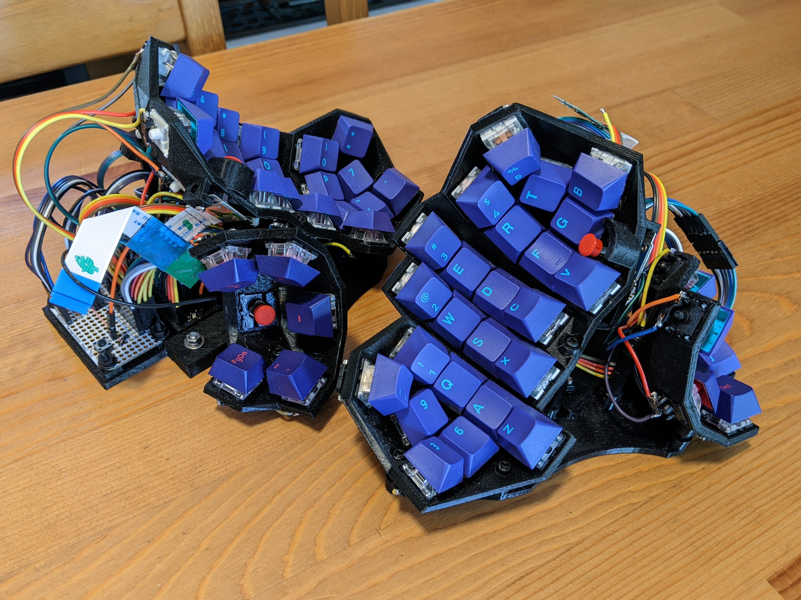

# What Is Try-A-Dactyl?
The goal of this project is to be a flexible API for generating ortholinear-ish (column-staggered) keyboards, and particularly split, concave keyboards often called dactyls. You can start with my preferred keyboard and modify it to your needs, or use the API to build your own 'from scratch' without the pain of re-writing the details you don't care about.

## Why Is TryÅdactyl Different
This project starts with the assumption that one-size does *not* fit all, and so a keyboard user will want to tune their dactyl to achieve the greatest comfort possible. In this process, a number of design-print-test iterations will be required and while the process of 3D printing can be a significant time delay, beyond a certain point its not possible to spend extra time designing and avoid the need to print and test. Given this, it makes sense to optimize the modeling software for faster iteration time at both the design and print level, and to expose both easy configuration for bootstrapping and more fine-grained control for tuning. This way you can Try All (the) Dactyls!

  * faster previews - writing in pure openscad rather than using a generator-style language binding lets us see changes as fast as possible
  * faster prints - support for multiple case styles allows quicker turn around with more open models like the [skeleton-edition style case](https://github.com/atsuyuki/dactyl-manuform-skeleton-edition-4x5), and then the ability to print the same layout with a more protected case with sidewalls
  * placement of the keycap tops, not the keywells - control where you want your fingers to be, not where the switches go; this means you can keep the same exact layout and switch from e.g. Cherry profile to DSA (provided the keycaps don't collide)
  * all parameters correspond to measurable quantities - combined with the above, makes it easier to say things like "I want to move the equals key 2 mm closer to my pinkie" and get the results you want
  * library / API style approach - gives you the tools to build what *you* want, and makes it easy to plug in different keyswitch / keycap styles without having to rewrite half the code
  * no post-processing needed - it should be easier to incorporate unanticipated additions directly in openscad than to take an stl and munge it somewhere else

I also aim to document an easy approach to handwiring that both simplifies the initial process and allows easy reuse of the electronics as you switch from case to case.

## How Does My Personalized Tryadactyl Stand Out?
  * uses Cherry keycaps as though they are a flat profile
  * concave, spherical thumb cluster, with a 5-way nav switch
  * **Trackpoint!**
  * spherical "pair" of columns under pinkie and index, with lowest key in the outside column moved to the homerow, one column further out
    * on the index, this makes room for the trackpoint without cutting keycaps
	* on the pinkie this makes for a more comfortable extension of the finger to the side to press shift, rather than curling up and pressing down and out
  * recessed magnets in the base plate, to hold the keyboard firmly to an adjustable metal tray

## Cool Software Features
  * orthogonal row/column placement styles including flat and cylindrical (cylindrical row + cylindrical column == spherical placement of thumb keys, for example)
  * pluggable support for new placement styles (spirals anyone?)
  * ability to automatically place things (like trackpoints, screws, and support struts) at the corners between keys so they don't collide with switches and keycaps, even when using complex placements
  * pluggable keycap support (add a new profile with a single function)
  * pluggable switch support (**TODO**)
  * per-key configuration overrides
    * stick an R1 key next to an R4 key without issues by changing keycap profile row
    * use 'traditional' modifier keys by setting a position offset
  * multiple case styles, automatically generated base plates, and easy manual tuning of strut or wall placement
  * visual indications in preview-mode for identifying keycap collisions (including travel, when pressed) or hotswap socket collisions with the model or each other

# Organization of the Code
These are abbreviated descriptions of what lives where. See the linked files for detailed documentation comments.

  * **Keys** - the most basic building blocks of a keyboard (you are unlikely to need these directly)
    * [keywell.scad](keywell.scad) - The `keywell()` is the basic switch holder. there are also various bounding boxes around the sides of the keywell used to stitch keywells together into a switch plate, and to generate sidewalls for a case when desired.
	* [keycap.scad](keycap.scad) - The `keycap()` model manages caching of pre-rendered `.stl`s when possible and by default hides the caps when rendering a keyboard for printing.  `position_flat()` orients a `keycap()`, or `keywell()` with the origin at the center of the top of the keycap. `effective_rows()` produces the data structure used to map column indexes to keycap profile rows used by a given layout, such as a keyboard without number row that uses only R2, R3, R4.

  * **Columns** - the main unit of organization for our designs, one or more columns per finger
  	* [column-layout.scad](column-layout.scad) - `layout_columns(rows, cols, homerow, homecol, ..., keys, wells, walls, ..., params)` is the main module exposed to the user for creating a keyboard. it creates a connected plate of `cols` key columns with `rows` rows. the `homerow` and `homecol` give the coordinates of the key that is centered on the origin. this is mostly important for curved placements. the boolean `keys` can be used to disable display of keycaps in previews, `wells` controls generation of the switch plate, and `walls` controls the creation of walls, which are independent of the switch plate. the booleans `leftwall`, `rightwall`, `topwall` and `bottomwall` control a separate way to generate simple, regular walls that are reasonable for flat keyboards with a shallow tent and tilt. a `wall_matrix` may be specified instead to give per-key control of the wall sides and distance (including multiple articulation points). the params struct is generated by the function below.
    * [column-util.scad](column-util.scad) - The function `layout_placement_params()` produces a pseudo-struct containing all the user supplied configuration parameters, for convenience. `layout_placement()` is the low level module all the higher level APIs use to uniformly place child modules at row, column coordinates, using the placement_params. The functions `create_flat_placement()` and `create_circular_placement()` create structs passed to `layout_placement_params()` for row or column alignment.  The flat placement take an [x, y] pair (or vector of pairs, or vector of vector of pairs) specifying distance in millimeters.  The circular placement takes a [chord, radius, angle] triplet (or vectors thereof) specifying the relationship between two points on a circle, using any two of: the the shortest-line distance between the points (a *chord*), the radius of the circle, or the angle between the two points from the center of the circle. `normalize_chord()` calculates the missing parameter from the other two, but should be automatically called anywhere a chord is accepted to sanitize the input. If a single value is provided to these functions, the spacing between successive rows or columns will be uniform. If a vector of values are provided, the distance used for each successive row or column relative to the previous can be tweaked. using a vector of vectors allows it to vary both per-row and per-column. missing rows, or columns, will be substituted with the last specified value. The `optional_vector_index()` automates this lookup-with-substitution process. `optional_index()` is the version used for scalars, like `rows`.

  * **Accessories**
    * [rest.scad](rest.scad) - `wrist_rest_base()` is the model for @crystalhand's holder for a silicone palmrest. this file invokes it and adds mounting dimples for rubber feet and a flush mount for a bar-shaped cup magnet. (**TODO** add @kennykaye style rest)
	* [trackpoint.scad](trackpoint.scad) - `install_trackpoint(row, col, ... displacement, params, ... use_shield ...)` places a mount for a trackpoint so that the stem rises through the intersection between keys nearer to the `homerow` and `homecol` of the key specified by `row` and `col`. displacement can be used to tweak this positioning without having to modify the `params` used for the rest of the switch plate. `h1` and `h2` can be used to move the arms of the trackpoint mount so they contact the switch plate and don't collide with the switches. `use_shield` enables a  cylindrical covering to protect the trackpoint stem extension, if the trackpoint is not fully encircled by keys.
	* [util.scad](util.scad) - utilities for hulling sets of modules while preserving their concavities; utilities for mounting magnets, rubber feet, microcontrollers, and other electronics.

  * **Keyboards**
	* [settings.scad](settings.scad) - controls various parameters mostly pertaining to key caps, switches, spacing and rendering settings
    * [assembly-util.scad](assembly-util.scad) - the `screw_mounting()` module and associated `screw_mounting_params()` function for adding screw-attached support struts between switch plate and base plate
	* [assembly.scad](assembly.scad) - my personal skeleton-edition style keyboard
	* [debug.scad](debug.scad) - my closed-case keyboard experimentation

# TODO
  * key (profile & switch/well) configuration architecture
    - [ ] add and test SA profile support
    - [ ] add and test DSA profile support
    - [ ] parameterize switch (choc, void, ???)
	  - [ ] use this to support SKRH and RKJXS nav switches instead of profile row?
	  - [ ] expand `mxstem()` to incorporate switch type
	  - [ ] how to generalize `innerdia`, `outerdia` and `thickness`
      - [ ] separate keywell use of `spacer()` from assembly.scad level use
        - [ ] think about automatic decisions about using minimum keywell dimension vs being wide enough to prevent hull from colliding with 1U keycap vs wide keycap support vs being as wide as whatever the keyspacing is to maybe avoid hulling if adjacent key is the same profile and has identical positioning (tent/tilt/offset etc.)
	- [ ] test traditional modifier key support
	  - [ ] add concept of key width or is using offset good enough?
  * columns
    - [ ] document layout_columns arguments
	- [ ] spiral placement
	- [ ] figure out how to connect 2 rectangles (faces of a keywell) in 3D space without hull (BOSL2?)
	  - [ ] alternatively use the corner sphere bounding boxes for _everything_ to guarantee thickness and accept the cost (and figure out how to avoid colliding with keycap)
  * case
    - [ ] finish closed case
	  - [ ] join the walls of each finger's switch plate
	  - [ ] consider bridging over some keys on the sides
	  - [ ] generate closed case base plate
	- [ ] add cylindrical perimeter to skeleton-edition case
	- [ ] support raised perimeter bezel
	- [ ] more wall code cleanup
	- [ ] hack up and test a @kennykaye-esque palmrest? use JellyTitan magnetic feet?
  * general
    - [ ] reorganize code into directories? and re-locate util functions
    - [ ] decide how multiple case style support and rendering of individual parts can be generalized
